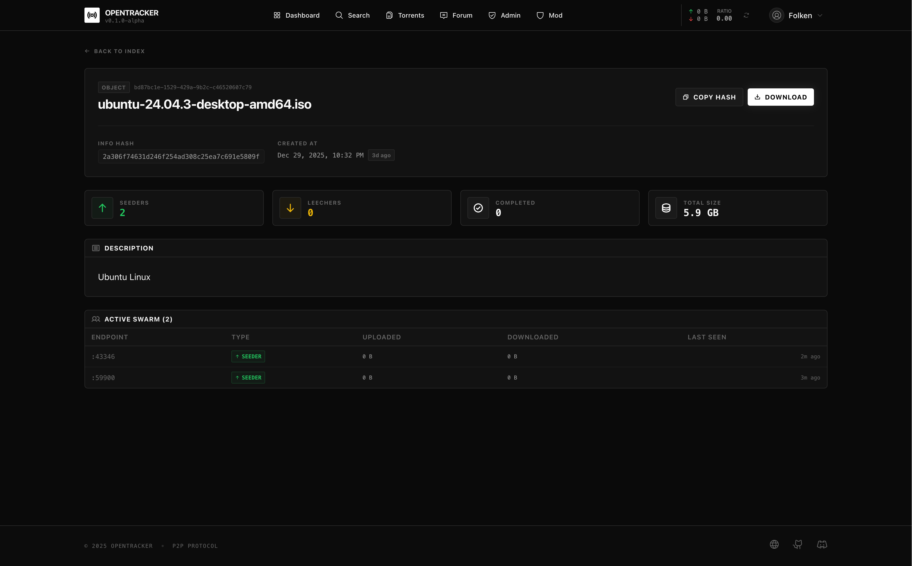
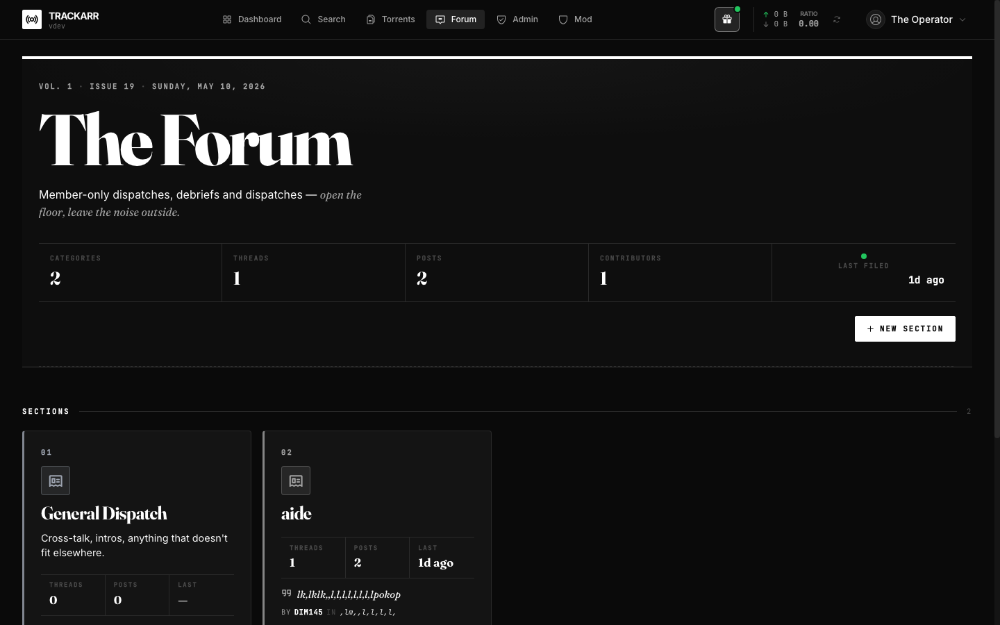
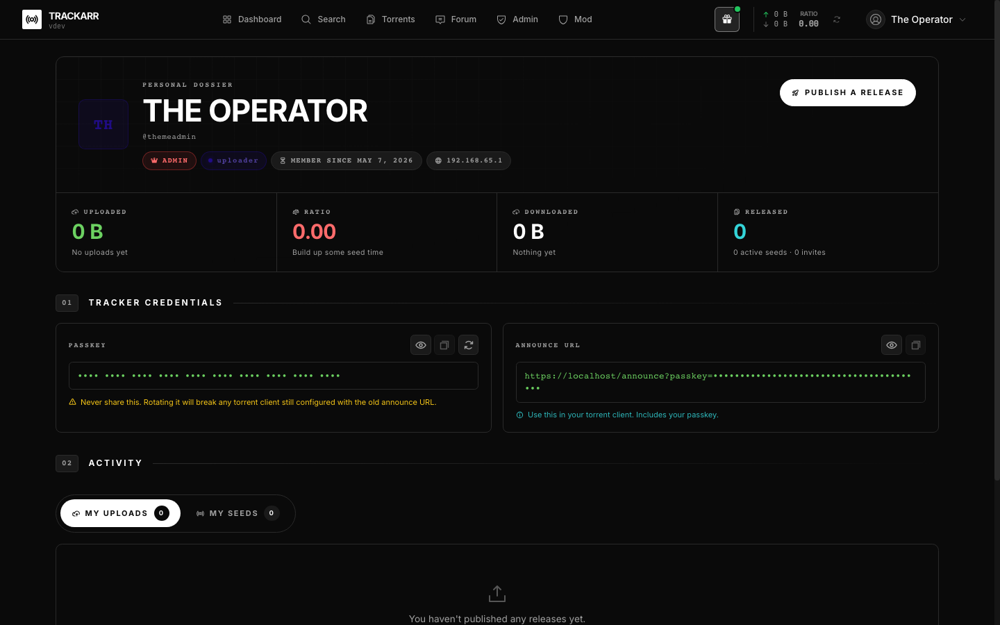
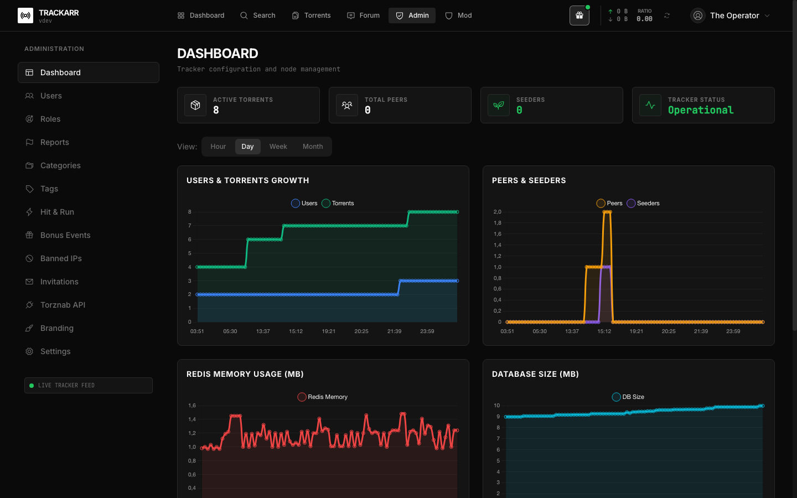
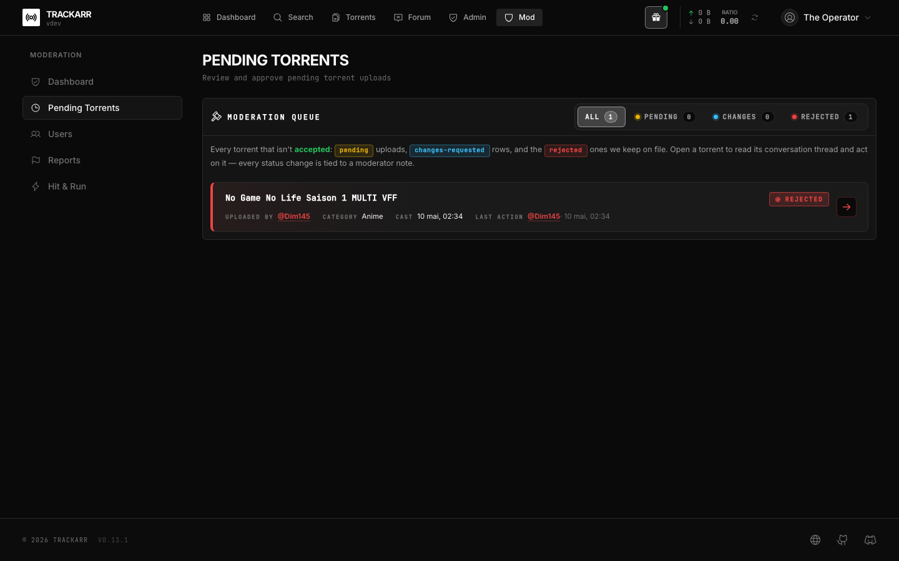

<div align="center">

# 🌐 Trackarr

**A modern, high-performance private BitTorrent tracker**

Three containers — Nuxt 4 web · Nitro API · Go tracker — backed by PostgreSQL and Redis.

[](https://nodejs.org/)
[](https://nuxt.com/)
[](https://go.dev/)
[](https://www.typescriptlang.org/)
[](LICENSE)

[Features](#-features) • [Architecture](#-architecture) • [Quick Start](#-quick-start) • [Static deployment](#-static-deployment-no-ssr) • [Documentation](https://dim145.github.io/opentracker/) • [Live Demo](https://tracker.florianargaud.com/)


</div>

---

## ✨ Features

### Privacy & authentication

- **Zero-Knowledge auth** — PBKDF2-600k + SHA-256 verifier; the password never leaves the browser. Same flow drives sign-in, passkey rotation, and change-password.
- **Proof of Work on registration** stops drive-by signup spam.
- **Hashed IPs** — SHA-256 with daily-rotating salt; no raw IP persisted. Banning a user atomically banlists their last-known IP.
- **Privacy toggles** — hide last-seen on public profile (mods/admins always see the truth).

### Browse, upload & operate

- **Rich media metadata** — TMDb (films + TV), IGDB (games), Open Library + Google Books (books); user locale drives the lookup language.
- **Smart media-id paste** — drop an IMDb / TMDb / TVDB / IGDB slug or ISBN into search to filter the listing.
- **Dedicated upload page** — auto title + tags from filename, multi-source search picker, duplicate preflight, conditional ID block per category, Tiptap WYSIWYG description, NFO drag-drop (CP437 → UTF-8).
- **Operator console** — `/admin` covers users, categories, roles, invites, branding, panic, tags, Torznab, reports, HnR.
- **Notification fan-out** — every event-emitting route hits Postgres + Redis pub/sub + the user's chosen external transport (SMTP, Telegram, Discord, ntfy, Gotify, Pushover, Slack, Mattermost, webhook, Apprise, **Web Push**).

### Tracker protocols

- **HTTP announce (BEP 3)** on `8080/tcp`; sub-ms p99; alloc-friendly bencode path.
- **UDP announce (BEP 15)** on `6969/udp`; ~6×–8× cheaper on the wire than HTTP; stateless `connection_id` = HMAC-SHA256(secret, ip ‖ minute), so no per-id memory.
- **BEP 41 URL_DATA passkey** — `udp://host:6969/announce/PASSKEY` works as-is in every modern client.
- **Multi-tier `.torrent` files** — generator advertises HTTP + UDP independently. `TRACKER_UDP_ENABLED=false` disables UDP and drops it from new `.torrent` files in one go.

### Bonus economy & resilience

- **Seed-bonus points** — customisable per-minute rules (time, torrent age, rarity); tiered curves with live preview; ledger-backed.
- **Bonus shop** — operator-curated catalogue with built-in `upload_credit` and `invite` effects.
- **Bonus events** — time-bounded Freeleech / Silverleech / custom multipliers, applied on the announce hot path.
- **Panic Mode** — instant AES-256-GCM encryption of torrent data + user fields; recovery requires the original Panic Password. See [Panic Mode](doc/guide/panic-mode.md).
- **Distributed rate limiting** — Redis-backed sliding windows; progressive penalties; auto IP bans.
- **Optional static deployment** — distroless nginx serves a CSR bundle in **~28 MB** (see below).

---

## 🏗️ Architecture

Three independent containers behind Caddy, plus the usual Postgres + Redis. They share zero process state — Redis is the only cross-cutting bus.

```
                          ┌─────────────────────────────────────────────┐
   Browser ──HTTPS──►     │ Caddy   :80 / :443 / :443/udp (HTTP/3)      │
                          │   /announce*  →  tracker  :8080   (BEP 3)   │
                          │   /api/*      →  api      :4000             │
                          │   /uploads/*  →  api      :4000             │
                          │   /*          →  web      :3000   (Nuxt SSR)│
                          └─────────────────────────────────────────────┘
   BT client ──UDP──►   tracker :6969   (BEP 15, bypasses Caddy — UDP can't be reverse-proxied)

           ┌──────────────┐    ┌──────────────┐    ┌──────────────┐
           │  apps/web    │    │  apps/api    │    │ apps/tracker │
           │  Nuxt 4 SSR  │    │  Nitro 4     │    │  Go 1.25     │
           │  Vue 3 / TS  │    │  Drizzle ORM │    │  sqlc        │
           │  (stateless) │    │  Zod, h3     │    │  HTTP + UDP  │
           └──────────────┘    └──────┬───────┘    └──────┬───────┘
                                      │                   │
                                      ▼                   ▼
                              ┌────────────────────────────────┐
                              │       PgBouncer  :6432         │
                              └────────────────┬───────────────┘
                                               ▼
                              ┌────────────────────────────────┐
                              │       PostgreSQL :5432         │
                              └────────────────────────────────┘

                              ┌────────────────────────────────┐
                       api ──►│       Redis    :6379           │◄── tracker
                              │  peers, sessions, rate-limit,  │
                              │  seed-bonus, notification bus  │
                              └────────────────────────────────┘
```

**Why three containers**

- **The tracker is its own thing.** It's the hot path — every BitTorrent client in the swarm hits `/announce` every few minutes. A static Go binary on `scratch` (~10 MB image, sub-ms p99) means a single broken Nuxt deploy can't take down announces. Two transports — BEP 3 over HTTP/8080 and BEP 15 over UDP/6969 — share one wire-agnostic processor.
- **API and web are split.** `apps/api` (Nitro standalone) owns every `/api/*` route, upload endpoints, metadata lookups, admin tools. `apps/web` is Nuxt SSR — rendered shell + page chunks. They scale and redeploy independently.
- **Distroless everywhere.** `apps/web` + `apps/api` run on `gcr.io/distroless/nodejs24-debian13:nonroot`; `apps/tracker` runs on `scratch`; the static frontend runs on `cgr.dev/chainguard/nginx`. No shells, no package managers, non-root by default.

More details: [Architecture guide](doc/guide/architecture.md).

---

## 🚀 Quick Start

### Prerequisites

- **Docker** 20+ and **Docker Compose v2**
- For production: a domain name, ports `80/443` open, an `ACME_EMAIL` for Let's Encrypt.

### Pre-built images

Trackarr publishes signed multi-arch images to GHCR — no need to build anything locally:

| Image                                                                  | Role                              |
| ---------------------------------------------------------------------- | --------------------------------- |
| `ghcr.io/dim145/opentracker/api:latest`                                | Nitro API                         |
| `ghcr.io/dim145/opentracker/front-ssr:latest`                          | Nuxt SSR web                      |
| `ghcr.io/dim145/opentracker/front:latest`                              | Static SPA (overlay)              |
| `ghcr.io/dim145/opentracker/tracker:latest`                            | Go BitTorrent tracker             |

Full list & tags: <https://github.com/Dim145?tab=packages&repo_name=opentracker>.

`docker-compose.prod.yml` pulls these by default; pin a specific tag with `IMAGE_TAG=v0.17.0`.

### Production deployment

```bash
git clone https://github.com/Dim145/opentracker.git /opt/trackarr
cd /opt/trackarr
cp .env.example .env

cat >> .env <<EOF
NODE_ENV=production
DOMAIN=your-domain.com
TRACKER_DOMAIN=tracker.your-domain.com
ACME_EMAIL=admin@your-domain.com

NUXT_SESSION_SECRET=$(openssl rand -hex 32)
ADMIN_API_KEY=$(openssl rand -hex 32)
IP_HASH_SECRET=$(openssl rand -hex 32)
CHANNEL_ENCRYPTION_KEY=$(openssl rand -hex 32)
DB_PASSWORD=$(openssl rand -base64 24)
REDIS_PASSWORD=$(openssl rand -base64 24)

NUXT_PUBLIC_TRACKER_HTTP_URL=https://tracker.your-domain.com/announce
NUXT_PUBLIC_TRACKER_UDP_URL=udp://tracker.your-domain.com:6969/announce
EOF

docker compose -f docker-compose.prod.yml up -d
```

Point `your-domain.com` + `tracker.your-domain.com` at the VPS IP, then open
**`https://your-domain.com`** — the first user to register becomes the admin
and is prompted to set a **panic password**.

Updates are a `git pull && docker compose -f docker-compose.prod.yml pull && up -d`
(or pin `IMAGE_TAG` to a release). Volumes (`postgres_data`, `redis_data`,
`uploads_data`, `caddy_data`) survive rebuilds.

Full walk-through, env reference, and operations: [doc/guide/getting-started.md](doc/guide/getting-started.md).

---

## 🪶 Static deployment (no SSR)

A second image — `ghcr.io/dim145/opentracker/front` — serves a fully static SPA
from **distroless Chainguard nginx**:

| | SSR (default) | **Static** |
| --- | ---: | ---: |
| Image size  | 254 MB | **28 MB** |
| Idle RSS    | ~120 MB | **~7 MB** |
| Cold start  | ~2 s | **<100 ms** |
| Base image  | `distroless/nodejs24` | **`chainguard/nginx`** |
| First paint | server-rendered HTML | SPA shell, hydrates client-side |

```bash
docker compose \
  -f docker-compose.prod.yml \
  -f docker-compose.static.yml \
  --env-file .env \
  up -d
```

The static bundle fetches `GET /api/runtime-config` on boot and patches
`useRuntimeConfig().public`, so the same image is portable across domains —
only the API container needs the `NUXT_PUBLIC_TRACKER_*_URL` vars.

---

## 🏗️ Tech stack

| Layer            | Technology                                | Notes                                              |
| ---------------- | ----------------------------------------- | -------------------------------------------------- |
| Frontend         | Nuxt 4, Vue 3, Tailwind CSS, Tiptap       | SSR by default, opt-in static SPA build            |
| API              | Nitro 4 (Node 24), Drizzle ORM, Zod       | Standalone container, distroless runtime           |
| Tracker          | Go 1.25, sqlc                             | `scratch`-based image, sub-ms announce p99         |
| Database         | PostgreSQL 16                             | `gin_trgm_ops` full-text, drizzle-kit `push`       |
| Connection pool  | PgBouncer                                 | Transaction-mode pooling                           |
| Cache / queue    | Redis 7                                   | Peer hashes, sessions, rate-limit windows, pub/sub |
| Reverse proxy    | Caddy 2                                   | Auto-HTTPS, HTTP/3                                 |
| Crypto           | Web Crypto API, scrypt, AES-256-GCM       | ZKE auth, Panic encryption                         |
| Observability    | Prometheus `/metrics`                     | Dedicated port on the API container                |
| Monorepo         | pnpm workspaces                           | `packages/{shared,db}` + `apps/{web,api,tracker}`  |

Security deep-dive: [doc/guide/security.md](doc/guide/security.md), [doc/guide/zero-knowledge-auth.md](doc/guide/zero-knowledge-auth.md), [doc/guide/panic-mode.md](doc/guide/panic-mode.md).

---

## 📸 Screenshots








---

## 🤝 Contributing

1. Fork the repository
2. Create a feature branch (`git checkout -b feature/amazing`)
3. Commit your changes (`git commit -m 'Add amazing feature'`)
4. Push to the branch (`git push origin feature/amazing`)
5. Open a Pull Request

The repo is a **pnpm monorepo**. For local hacking, see [Getting Started — Local development](doc/guide/getting-started.md#local-development); for running the full container stack on your laptop, see [Local Production](doc/guide/local-production.md).

---

## 🙏 Acknowledgements

Trackarr is built on the shoulders of giants. Thanks to the following open-source projects:

| Project                                                                | Role                          |
| ---------------------------------------------------------------------- | ----------------------------- |
| [Nuxt](https://nuxt.com)                                               | Fullstack Vue framework       |
| [Vue.js](https://vuejs.org)                                            | Reactive frontend framework   |
| [Nitro](https://nitro.build)                                           | Universal JS server engine    |
| [Drizzle ORM](https://orm.drizzle.team)                                | TypeScript ORM                |
| [sqlc](https://sqlc.dev)                                               | Go DB codegen for the tracker |
| [PostgreSQL](https://www.postgresql.org)                               | Database                      |
| [Redis](https://redis.io)                                              | In-memory cache               |
| [ioredis](https://github.com/redis/ioredis)                            | Redis client for Node.js      |
| [Caddy](https://caddyserver.com)                                       | Reverse proxy + HTTPS         |
| [Chainguard](https://www.chainguard.dev)                               | Distroless container images   |
| [Tailwind CSS](https://tailwindcss.com)                                | Utility-first CSS             |
| [Tiptap](https://tiptap.dev)                                           | WYSIWYG editor                |
| [Chart.js](https://www.chartjs.org)                                    | Charts & visualizations       |
| [Iconify](https://iconify.design)                                      | Icon framework (Phosphor set) |
| [VitePress](https://vitepress.dev)                                     | Documentation framework       |
| [Pinia](https://pinia.vuejs.org)                                       | State management              |
| [Zod](https://zod.dev)                                                 | Schema validation             |
| [TMDb](https://www.themoviedb.org)                                     | Films + TV metadata           |
| [IGDB](https://www.igdb.com)                                           | Video-game metadata           |
| [Open Library](https://openlibrary.org)                                | Books + ebook metadata        |
| [Google Books API](https://developers.google.com/books)                | Books metadata (fallback)     |
| [web-push](https://github.com/web-push-libs/web-push)                  | RFC 8291 / 8292 push delivery |

---

<!-- CONTRIBUTORS:START -->

## 👥 Contributors

Thanks to all our contributors! Sorted by number of commits.

|                                                      Avatar                                                       | Contributor                             | Commits |
| :---------------------------------------------------------------------------------------------------------------: | --------------------------------------- | :-----: |
|  | **[Dim145](https://github.com/Dim145)** |    4    |
|  | **[IkiaeM](https://github.com/IkiaeM)** |    4    |

<!-- CONTRIBUTORS:END -->

---

## 📄 License

MIT License — see [LICENSE](LICENSE) for details.

---

<div align="center">

**Built with ❤️ for the P2P community**

[Back to top](#-trackarr)

</div>
